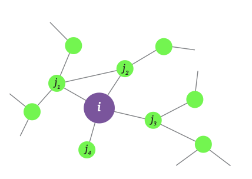

> 王航专用《复杂网络》复习笔记

------

# 《复杂网络》

[TOC]

## 1、什么是复杂网络？

复杂网络：复杂系统+背后的网络科学

- 复杂性：任何常规的系统构成部分分析都完全**无法解释**的。这些现象通常被称为**突发行为**，似乎发生在许多涉及生物体的复杂系统中，如**股票市场**或**人脑**
- 每个复杂的系统背后都有一个网络，它定义了各组成部分之间的相互作用。
- 只有我们在深刻理解网络之后才能分析出这个网络
- 推动网络学科发展的两大动力：
  - 网络分析：图论、社会网络、交流网、生态网
  - 网络科学：电影网、www、引用网……
- **网络科学**的特征：
  - 跨学科 
  - 经验性、数据驱动
  - 定量和数学 ：为了促进网络科学的发展，必须掌握其背后的数学工具
  - 计算 
- 网络的影响：科技、经济、生物、流感、脑科学、社会管理……

- [下载链接1](facebook.com/NetworkScienceBook)
- [下载链接2](barabasilab.com/NetworkScienceBook)

## 2、本门课程主要学习什么？

- 了解网络结构如何影响复杂系统的**鲁棒性**
- 开发定量工具，来评估网络结构与网络上的动态过程之间的**相互作用**及**其对故障的影响；**
- 寻找网络故障产生的原因，使用科学的网络对其进行**量化**和**设计**  

## 3、网络的表示方法

- 复杂网络的组成：

  - 组件：节点、顶点$N$
  - 交互：链路、边$L$
  - 系统：网络、图$(N,L)$

- 图的分类（边是否有方向）：

  - 有向图
  - 无向图

- **度**

  - 度：$K_A=1,$$K_A = K_{A}^{in}+K_{A}^{out}$
  - 出度：$K_{A}^{out}=1$
  - 入度：$K_A^{in}=1,$

- **平均度：**

  - 有向图：$<k> \equiv  \frac{1}{N}\sum_{n = 1}^{N}k_i$、$<k>\equiv \frac{2L}{N}$
  - 有向图：$<k^{in}> \equiv  \frac{1}{N}\sum_{n = 1}^{N}k_i^{in}$、$<k^{out}> \equiv  \frac{1}{N}\sum_{n = 1}^{N}k_i^{out}$、$<k^{in}>=<k^{out}>$、$<k>\equiv\frac{L}{N}$

- **度分布**：度等于$i$的概率$P(i) = \frac{N_i}{N}$。$N_i$：表示度为$i$的所有节点数量，$N$表示总的节点数量
  $$
  \sum_{0}^{\infty}p_i=1	\tag{1}
  $$
  
  $$
  \int_{K_{min}}^{\infty} p(k) \,dk = 1	\tag{2}
  $$

- **邻接矩阵**

$$
A_{ij}=\left(                 %左括号
  \begin{array}{}   %该矩阵一共3列，每一列都居中放置
    0 & 1 & 0 & 1\\  %第一行元素
    1 & 0 & 0 & 1\\  %第一行元素
    0 & 0 & 0 & 1\\  %第一行元素
    1 & 1 & 1 & 0\\  %第一行元素
  \end{array}
\right)   \tag{3}
$$

$A{ij}=1$,$i$和$j$之间存在边。$A{ij}=0$,$i$和$j$之间不存在边。

- 真实的网络是稀疏矩阵

- 带权网络：$A_{ij}=w_{ij}$

- 双向图

- 最短路径计算：迪杰特斯拉算法（Dijkstra）

- 连通图：

  - 强连通：每一个节点都有到其他所有节点的路径（有向图双向）
  - 弱连通：每一个点都有到其他点的路径（无向图）
  - 源点：出发点
  - 汇点：结果点

## 4、聚类系数
$$
C_i=\frac{2e_i}{k_i(k_i-1)}\tag{4}
$$

$k_i$为节点$i$的度，$e_i$除了连接节点$i$的边的个数，（所有跟$i$相邻节点边中除了和$i$相邻的边之后剩余的边）并不是图中剩余边。
$$
C = \frac{2\sum_{i=0}^{N}e_i}{\sum_{i=1}^{N}k_i(k_i-1)}\tag{5}
$$

  

$$
<C> = \frac{1}{N}\sum_{i=1}^{N}\frac{2e_i}{k_i(k_i-1)}	\tag{6}
$$
  

## 5、随机网络

- **是什么？**
  - $p = 1/6,N=10,<k>\sim=1.5$
  - 随机图是一个由$N$个节点组成的图，其中每对节点都以概率$p$连接。

- 度分布：二项分布

$$
P(k)=C^{k}_{N-1}p^k(1-p)^{(N-1)-k}\tag{7}
$$
$$
<k> = p(N-1)\tag {8}
$$
$$
\sigma^2_k=p(1-p)(N-1)\tag{9}
$$
$$
\frac{\sigma_k}{<k>}=[\frac{1-p}{p}\frac{1}{N-1}]^{1/2}\approx\frac{1}{(N-1)^{1/2}}\tag{10}
$$

当N较大k较小的时候服从泊松分布
$$
P(k) = e^{-<k>}\frac{<k>^k}{k!}\tag{11}
$$

- **真实网络不是泊松分布**
- 如何构建？
  - N个节点
  - 任意连接两个节点
- 二项系数
- 相变点：相变现象

## 6、scale-free NetWork（了解）

存在Hub

在度分布上符合**幂率**（特定幂函数）的网络
$$
P(k)=Ck^{-\gamma}\tag{12}
$$

$\gamma$一般小于3

## 7、BA模型

- ER模型：
  - 节点数量$N$是固定的（静态）
  - 网络规模随着节点数量增加而扩大
  - 链路数量随机增加
  - 新节点更倾向于连接有更多节点的hub节点
- 随机网络和真实网络的两个重要区别：
  - **增长性：**随机网络中节点数量是固定的（同一时间），真实网络中的节点数量是不断增加的。
  - **优先依附性**：随机网络中节点是随机依附的，在真实网络中，节点往往更倾向于选择度比较大的hub节点。
- SF网络
  - 网络节点不断增长
  - 新节点更倾向于链接度大的节点 
  - 度分布

$$
\prod(k_i)=\frac{k_i}{\sum_{j}k_j}\tag{13}
$$
$$
P(k)\backsim k^{-3}\tag{14}
$$

**$\gamma$通常取3**

- SF网络

  - 度动态变化，所有节点遵循相同的增长规律

$$
\frac{\partial k_i}{\partial t}\varpropto \prod(k_i)=A\frac{k_i}{\sum_jk_j} \tag{15}
$$

- BA模型：

  - 度分布$P(k)=\frac{2m(m+1)}{k(k+1)(k+2)}$ 
- 非线性依附，节点更倾向于连接度比较大的hub节点

  - 链路选择模型：
    - 每步增加一个新的节点
    - 随机选择一条链路，将新节点链接到链路两端
    - 度：$q_k=Ckp_k$、$q_k=\frac{kp_k}{<k>}$
  - 复制模型：
    - 随机连接：以概率$p$将新节点连接到$u$
    - 复制：以概率$1-p$随机选择不包含节点$u$的一条链路，并将新节点连接到$u$。这时候新节点复制了早起节点一条链路
  - 优化模型：
    - $C_i= min_j[\delta d_{ij}+h_j]$

- BA模型的量：

  - 节点数量：$N=t$
  - 链路条数：$N=mt$
  - 平均度：$<k> = 2m$
  - 动态度：$k_t(t)=m(t/t_i)^{\beta}$
  - 动态指数：$\beta=1/2$
  - 度分布：$p_k\backsim k^{-\gamma}$
  - 度指数：$\gamma=3$
  - 平均距离：$<d>\backsim \log N/\log \log N$
  - 聚类系数：$<C>\backsim (\ln N)^2/N$
- 构建网络3步：
  - 假设已经有一个小型网络
  - 新的节点加入网络
  - 新的节点链接到已有链路

## 8、网络演进

- BA模型只是一个最小模型：假设了线性增长，假设了线性链接
- Bianconi-Barabasi model：$k(t)\backsim t^{1/2}$
- Fitness Model：$k(\eta,t) \backsim t^{\beta(\eta)}$,$\beta(\eta)=\eta/C$

## 9、度相关性

- 度相关性
  - Assortative（同配性）：hub节点表现出和hub节点相连的特性。
  - Neutral（中性）：节点随机相连
  - Disassortative（异配性）：hub节点避免和hub节点相连

- **测量方法：**

  - 完全统计描述（统计学方法）

    - $e_{j,k}$：在随机选择的边的两端找到度数为$j$和度数为$k$的节点的概率：

      $\sum_{j,k}e_{jk}=1$,$\sum_{j}e_{jk}=q_k$

      $q_k$：链路末端有一个度为$k$的节点

      $q_k=\frac{kp_k}{<k>}$

      $e_{jk}=q_jq_k$

    - 难以从矩阵（直观）中提取信息

    - 基于$e_{jk}$，因此需要大量的计算

  - 度相关性函数（**一阶邻居度的大小**）

    - $k_{annd}(k)$：一阶邻居度的大小
    - $k_{nn}(k_i)=\frac{1}{k_i} \sum_{j=1}^{N}A_{ij}k_j$
    - $k_{nn}(k)\equiv \sum_{k^{'}}k^{'}P(k^{'}|k)$

  
  $$
  k_{annd}^v=\frac{4+3+3+1}{4}
  $$
  

  - 相关系数
    - 如何计算

## 10、社团检测

- 连通性假说：
  
  - 一个社团对应一个连通子图
- 密度假说：
  
  - 社团对应于网络的局部密集区
- $k^{int}$：连接到同一社团其他节点的链接集合
- $k^{ext}$：链接到其他社团的链接集合
- 社团定义：
  - 最大社团$\delta^{int}(C)=1$
  - 三角形是常见的，较大的小团体不常见
  - 社团并不对应完整的子图，因为他的许多节点并不直接相互连接。
  - 寻找网络中的小团体在计算上是相当难的，是一个所谓的NP-完全问题
  - **强社团：**子图中的每个节点拥有比图中其他节点更多的链接
$$
K_i^{int}(C)>k_i^{ext}(C)\tag{16}
$$
  - **若社团**：子图的内部总度超过其外部总度
    
$$
\sum_{i \in C}k_i^{in}(C)>\sum_{i \in C}k_i^{out}(C)\tag{17}
$$
- 图分割
- 社团检测：社团的数量和规模在开始时是未知的，将具有相同和近似性质的节点归为一类。
- 分割：将网络分为若干节点组，使每个节点属于一个组。
- **检测方法**：
  - 层次化聚类
    
    - 自底向上（聚合算法）：使用相似矩阵，将高度相似的矩阵放在同一矩阵中
      - 步骤1：定义相似矩阵
      - 步骤2：确定群体相似度
      - 步骤3：使用层次化聚类：将每个节点分配到一个社区中并计算相似性，直到找到相似性最小的一个，重复第二步直到所有节点都被分到同一个社区中
      - 步骤4：构建层次树，描述将节点分配给社区的精确度
    - 自顶向下（分割算法）：通过断开中心性较大的边来实现。
      - 定义链接边的中心性
      - 层次化聚类：计算每条边的中心性，将中心性最大的边去掉，并不断重复直到满足某一阈值
      - 构建层次树进行描述。
    
  - 模块化：
    - 优化分割，使模块化程度最大化
    - 次优，但适应模块
    - 负模块化，把每个节点分配给不同的社团
    - 零模块化，将所有节点分配给同一个社团，我们得到独立于网络结构。
    - 模块化程度取决于网络规模大小
    - 步骤：
      - 1、将每个节点分配给自己的社团，如以 "社区 "开头。
      2. 2、检查每一对至少由一条链路连接的社团，并计算如果我们合并这两个社团所得到的模块化变化。
      3. 识别出$ΔM$最大的社团对，并将它们合并。注意，特定分区的模块化总是从网络的完整拓扑结构中计算出来的。
      4. 重复步骤2，直到所有节点都被合并到一个社区。
      5. 对每一步进行记录，并选择最大的分区。
- 重叠社团

## 11、网络鲁棒性

- 含义：网络的健壮性

- 在复杂网络中的含义：随机的删除一些节点，直到网络中不存在最大连通子图

- 崩溃阈值（任意网络）
  $$
  f_c=1-\frac{1}{\frac{<k^2>}{<k>}-1}\tag{18}
  $$
  当$f<f_c$的时候网络仍然是连接的，当$f>f_c$的时候网络崩溃

- Scale-free在随机故障下不会出现奔溃—>原因：随机去掉hub节点的可能性太小了。

  - $f_c=1-\frac{1}{\mathcal{K} -1}$
  - 

$$
\mathcal{K} = \frac{<k^2>}{<k>} = \left\lvert \frac{2-g}{3-g} \right\rvert \left\{ 
\begin{array}{rcl}
K_{min}, & & g>3\\
K_{max}^{3-g}K_{min}^{g-2},&& 3>g>2\\
K_{max},&& 2>g>1
\end{array} 
\right.\tag{19}
$$

- $K_{max}=K_{min}N^{\frac{1}{g-1}}$

- 攻击阈值：去掉hub节点中的一部分

## 12、感染模型

- S（易感染）：没有接触病原体的健康个体
- I（已感染）：已经被感染，并且能够感染其他人
- R（恢复\去世）：已经感染，并且产生抗体不会继续感染
- SIS、SI、SIR模型

