> 王航专用《现代密码学》复习笔记

# 现代密码学

[TOC]

考试形式：7填空x4+7计算x8+1综合分析x16

## 1、密码学基础

**考点：古典密码（凯撒\维吉尼亚）加解密、  密码分析的分类**

- 密码学分类：密码编码学+密码分析学
- 重要概念：明文、密文、加密算法、解密算法、密钥、发送者、接收者、截收者（窃听者）、密码分析、**主动攻击**（入侵假冒）、**被动攻击**（窃听分析）
- 保密系统模型
  - 明文消息空间$M$
  - 密文消息空间$C$
  - 密钥空间$K_1$、$K_2$，对称加密中$K_1=K_2=K$
  - 加密变换：$E_{k_1} \in E, m \rightarrow c=E_{k_1}(m)$，其中$k_1 \in K_1,m \in M, c \in C$
  - 解密变换：$D_{k_2} \in D, c \rightarrow m = D_{k_2}(c)$，其中$k_2 \in K_2, m \in M, c \in C$

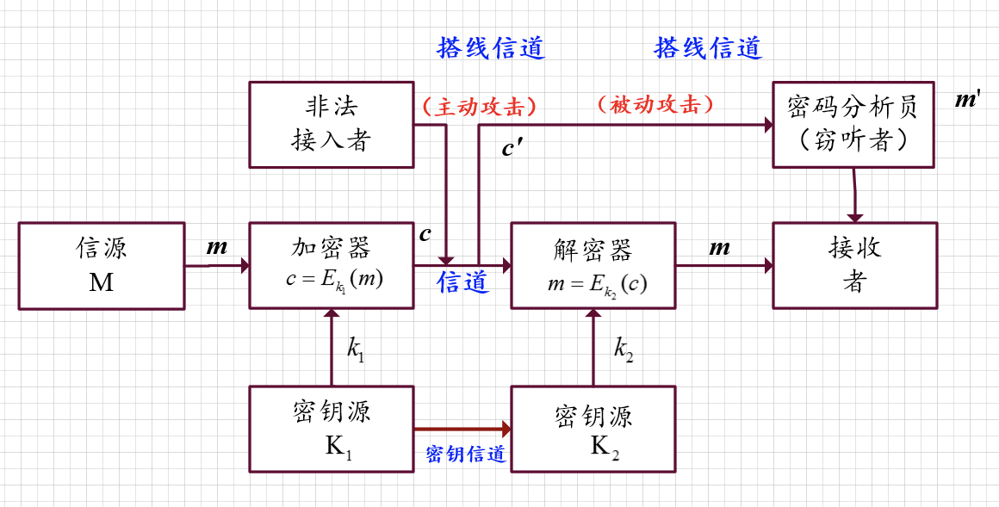

- Kerckhoff原则：系统的保密性不依赖于对加密体制或算法的保密，而依赖于密钥

- 信息安全三要素：CIA

- 密码体制分类：

  - 单钥体制：流密码、分组密码。  不仅能用于数据加密，也可用于消息的认证

  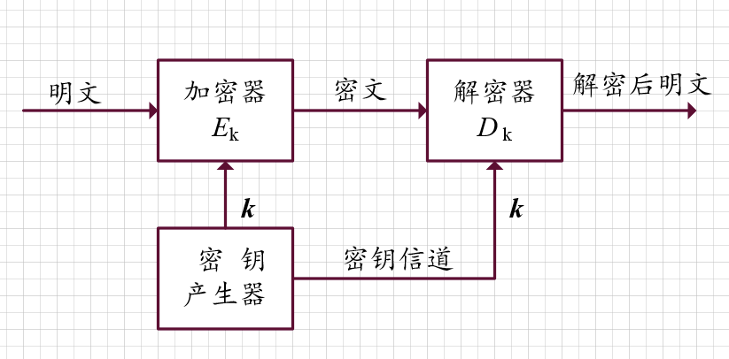

  - 双钥体制：RSA、ECC等。认证和保密
    - 保密
    - 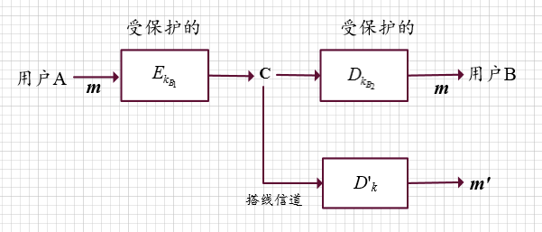
    - 认证
    - 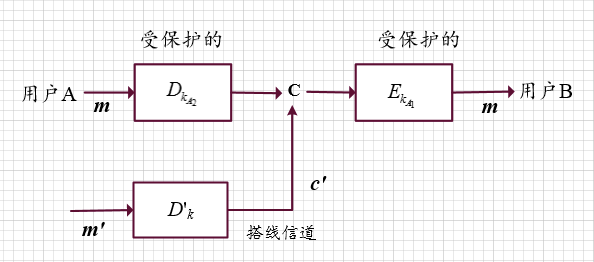
    
    - 保密+认证（先签名后加密）
    - 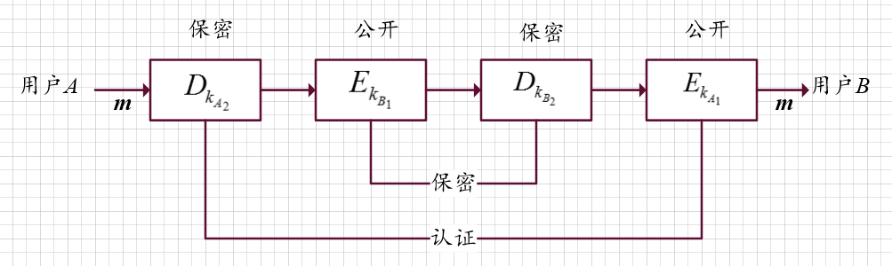
  
- **古典密码（代换）**

  - 移位代换：Caeser， k=3
  - 乘数密码：$E_k(i)=ik \equiv j \mod\ q, (k,q)=1$
  - 仿射变换：$E_k(i)=ik_1+j \equiv j\ mod \ q$，$(k_1, q)=1$
  - 多项式代换：$E_k(x) \equiv k_tx^t+k_{t-1}x^{t-1}+\cdots+k_1x+k_0 \mod q$
  - 密钥短语：用来构造代换表
  - 多表代换：**维吉尼亚**、博福特密码、滚动密钥密码、弗纳姆密码、转轮密码
  - 矩阵变换：Hill密码

- 密码分析学：

  - 穷举破译法
    - 遍历明密文空间
  - 分析法
    - 确定性
      - 通过明密文之间关系列出线性方程组并求解
    - 统计性
      - 统计字频

- **密码分析种类：**唯密文破译、已知明文破译、选择明文破译（加密黑盒子）、选择密文攻击（攻击强度依次递增，难度依次减弱）

- 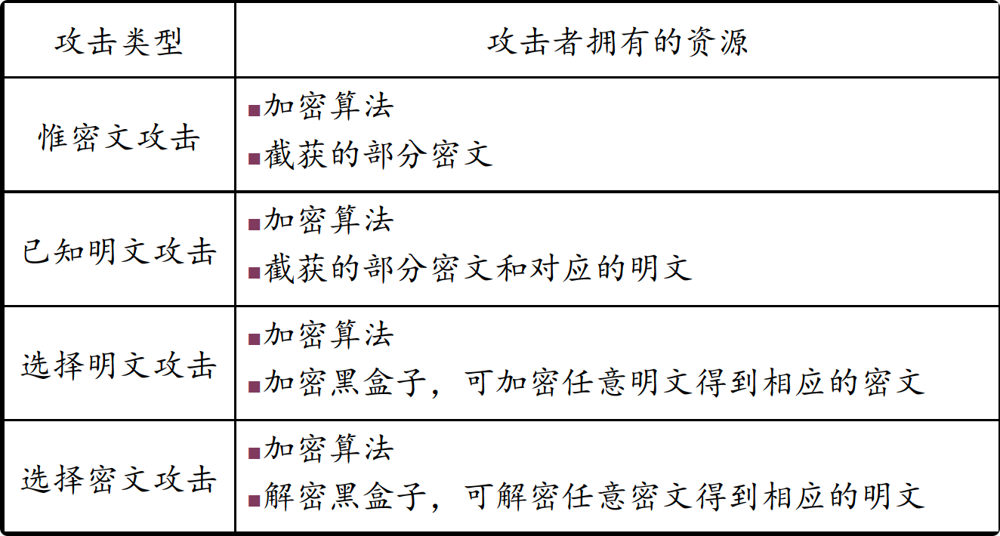

## 2、流密码基本概念

**考点：**递推关系求序列、密码破译

流密码强度完全依赖于密钥流产生器所生成序列的**随机性**和**不可预测性**
$$
x=x_0x_1x_2\cdots\\
z=z_0z_1z_2\cdots\\
y=y_0y_1y_2\cdots\\
y_i=x_i\oplus z_i\\
x_i=y_i \oplus z_i
$$

- 同步流密码：密钥流产生算法和明文无关
- 自同步流密码：密钥流产生算法和明文相关
- **LFSR**：$f(a_1,a_2,\cdots,a_n)=c_na_1\oplus c_{n-1}a_2 \oplus \cdots \oplus c_1a_n$
- n级LFSR状态数：最多$2^n$个
- n级LFSR状态周期数：$\leq2^n-1$
- **选择合适的反馈**函数使序列的周期达到最大$2^n-1$，周期达到最大值的序列称**为$m$序列**
- 随机性公设
  - 在序列的一个周期内，0与1的个数相差最多为1
  - 在序列的一个周期内，长为i的游程占游程总数的$1/2^i$,在等长的游程中0的游程个数和1的游程个数相等
  - 异相自相关函数是一个常数
- ZUC

## 3、分组密码

**考点：基本概念、攻击、设计原则、 AES的S盒、工作模式（掌握）**

- 分组密码主要攻击：已知明文攻击—>多次使用同一个密钥

- 为了抵抗已知明文攻击，必须具备的特性：**混淆性**和**扩散性**

- 分组密码的设计准则：

  - 安全性：无法解决明文、无法接近密钥
  - 简洁性：字长适应软件编程、使用计算机支持的操作：加法、乘法、移位
  - 有效性：密钥最大限度地起到安全性的作用
  - 透明性和灵活性：避免存在黑盒，可以适应多种长度的明密文
  - 加解密相似性：加解密算法相同，仅密钥编排不同

- 分组密码的设计技巧：

  - 计算部件：S盒用来混淆
  - 计算部件的组合
  - SPN（即替换/置换网络）：Feistel网络$L_{r+1}=R_r,R_{r+1}=L_r \oplus F(k_r,R_r)$

  - 多轮迭代与轮函数

- **工作模式**：

  - 电码本（ECB）：相同明文对应相同密文

  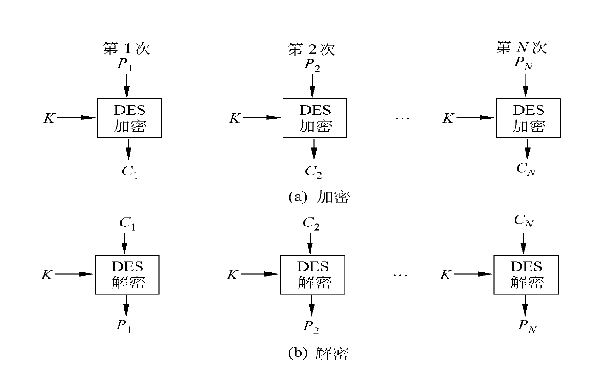

  - 密码分组链接（CBC）：$c_i=E_k(m_i \oplus c_{i-1})$、$m_i=D_k(c_i) \oplus c_{i-1}$，两步错误传播、明文统计特性得到隐藏

  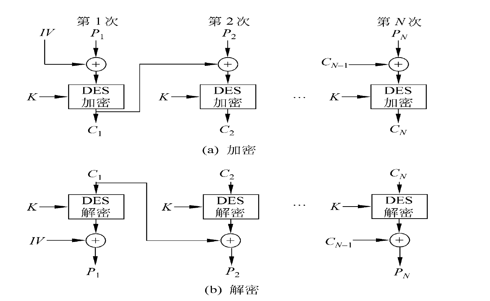

  - 密码反馈（CFB）：$c_i=x_i \oplus left_r(E_k(c_{i-l} \cdots c_{i-2}c_{i-1}))$

  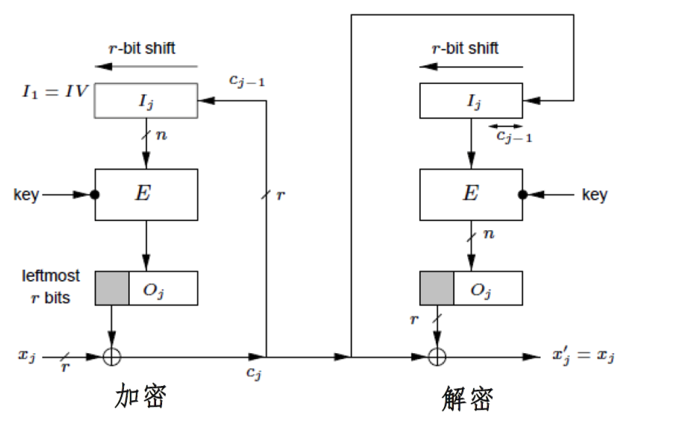

  - 输出反馈（OFB）

  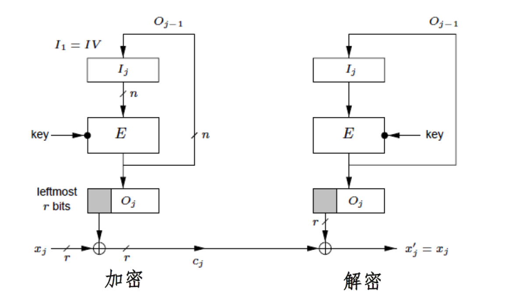

  - 计数器（CTR）
  - 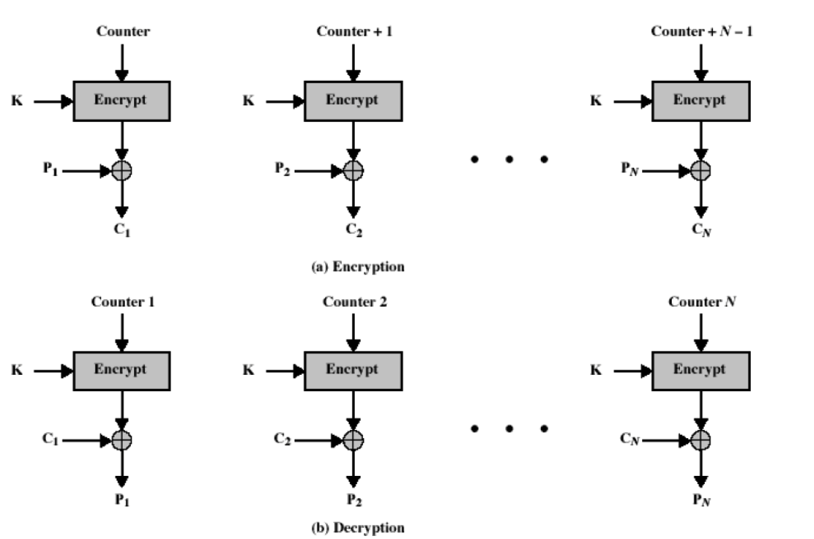

- DES：分组长度64、密钥长度64（有8个校验位，有效长度56）、算法主要包括：

  - 初始置换$IP$
  - 16轮迭代
  - 逆初始置换$IP^{-1}$
  - 代换盒S盒、P盒、PC

- DES攻击：二重DES的中间相遇攻击、三重DES（加密、解密、加密）双密钥下

- AES设计标准：

  - 抗所有已知攻击
  - 在多个平台上速度快、编码紧凑
  - 设计简单

- AES算法：

  - **字节代替**
  - 行移位
  - 列混合
  - 密钥加
  
- AES相关参数：

  - 明文分组：128、192、256
  - 密钥长度：128、192、256

## 4、公钥密码

**考点：RSA、背包、EIGamal、单项陷门函数、RSA的攻击**

- 公钥体制的基本原理：**限门单向函数**

- 单向函数举例：离散对数DL、大整数分解FAC、背包问题（超递增背包）、格的最小向量问题SVP

- **RSA**
  - 密钥生成过程
    - 随机产生大素数$p$和$q$
    - 计算$n=pq$和$\varphi(n)=(p-1)(q-1)$
    - 随机选择整数$e,1<2<\varphi(n)$，使得$(e,\varphi(n)) = 1$
    - **计算整数$d$，使得$ed \equiv1(mod \ \varphi(n))$**
    - 公钥$K_A^e= (n, e)$
    - 私钥$K_A^d= (d,n)$
  - **加密过程**
    - $c \equiv m^e(mod \ n)$
  - 解密过程
    - $m\equiv c^d(mod \ n)$
  - 存在的攻击
    - 共模攻击
    - 低指数攻击
    - 已知密文对攻击：
      - 已知$(m_1,c_1),(m_2,c_2)$
      - $if\ c=c_1c_2(\mod n), \Rightarrow m=m_1m_2(\mod n)$
      - $if\ c=c_1/c_2(\mod n), \Rightarrow m=m_1/m_2(\mod n)$
      - $if\ c=c_2/c_1(\mod n), \Rightarrow m=m_2/m_1(\mod n)$
  
- **背包密码**
  
  - 密钥生成：
    - 超递增背包向量$A=(a_1,a_2,a_3, \cdots,a_n)$
    - 变化参数：$k$,$t$
    - 计算加密背包：$B=t \cdot A \mod k$
  - 加密：
    - 将信息写成跟背包向量等长的二进制，对应去乘$B$
  - 解密：
    - $t^{-1} \equiv mod\ k$
    - $c \cdot t^{-1} mod\ k$
    - 将第二步得到的数字，用原始背包向量去减，直到为0
  
- Rabin 不考 :peach:，基于二次剩余
  - 密钥产生：$n=pq$，$n$是公钥，$(p,q)$是私钥

  - 加密：

    - 将信息表示为整数$m, 0\leq m \leq n-1$
    
  - 计算 $c \equiv m^2(mod\ n)$
    
  - 解密
    
  - $$
    \left \{
    \begin{align}
    x^2 \equiv c (mod\ p)\\
    x^2 \equiv c (mod\ q)
    \end{align}
    \right.
    $$
  
- **EIGamal**

    - 密钥生成：
        - 选择大素数$p$
        - 选择$g$，$1<g<p$
        - 选择$x$，$1<x<p-1$
        - 计算$y \equiv g^x \mod p$
        - 公钥：$(p,g,y)$
        - 私钥：$(p, x)$
    - 加密
        - 挑选随机数$k$,$(k,p-1)=1$,计算$y_1=g^k \mod p$
        - 使用公钥计算$y_2=my^k \mod p$
        - 最终结果$c=y_1 \| y_2$
    - 解密
        - $m^{'}\equiv \frac{y_2}{y_1^x}= \frac{my^k}{g^{kx}}=\frac{mg^{xk}}{g^{xk}} \mod p$

- NTRU不考 :apple:

- 椭圆曲线

    - $E:y^2=x^3+a_4x+a_6$，判别式$\Delta = -16(4a_4^3+27a_6^2) \neq 0$

    - $F_p$点的计算，$P_1=(x_1,y_1),P_2=(x_2,y_2)$是曲线$E$上的两个点，$O$为无穷远点，则

      - $O+P_1=P_1+O$

      - $-P_1=(x_1,-y_1)$

      - $P_3=(x_3,y_3)=P_1+P_2 \neq O$

      - $$
        \left \{
        \begin{aligned}
        x_3=\lambda ^2-x_1-x_2\\
        y_3=\lambda(x_1-x_3)-y_1
        \end{aligned}
        \right.
        $$

      - $$
        \lambda =
        \left \{
        \begin{aligned}
        \frac{y_2-y_1}{x_2-x_1},\ x_1 \neq x_2\\
        \frac{3x_1^2+a_4}{2y_1},\ x_1=x_2
        \end{aligned}
        \right.
        $$

## 5、数字签名

**考点：哈希函数、生日攻击、EIGamal签名（掌握）、RSA签名面临的问题，以及如何解决、Schorr签名（了解，优先算的问题）**

- hash函数
  - 将任意长度的比特串$x$压缩成为固定长度的比特串$y$
  - 已知$x$，计算$y=H(x)$很容易，已知$y$，找一个$x$满足$y=H(x)$很困难，这一性质称为**单向性**。
  - 找$(x_1,x_2),x_1 \neq x_2, H(x_1)=H(x_2)$很困难，这一性质称为**无碰撞性**
- 生日攻击
  - $P(m, N)$表示一个篮子中至少有两个球的概率
  - $1-e^{\frac{-m(m-1)}{2N}}\leq P(m,N) \leq \frac{m(m-1)}{2N}$
  - 选择$\sqrt m$个$F$的随机元素就能以1/2的概率产生一个碰撞
- MD5已经不安全了、SHA-1 现在也不够安全，推荐使用SHA-2

- 数字签名应该具有的性质：完整性、身份唯一性（不可伪造性）、不可否认性（公开可验证）
- RSA签名存在的问题：**重放攻击和拼接**， 解决办法：
  - 对签名过得消息进行备案（签名过就不再签名），不能抵拼接的
  - 加时间戳
- 签名和加密的先后顺序：**先签名后加密**，先加密后签名会造成**抵赖**的问题。
- **RSA签名**：
  - 公私钥产生参见RSA加密算法，$(n,e)$公钥，$(d,n)$为私钥
  - 计算散列值：$h=H(m)$
  - 签名：$s=h^d \mod n$
  - 发送内容：$(m,s)$
  - 验签：$H(m)=s^e \mod n$
- EIGamal签名
  - 公私钥生成参见EIGamal加密算法，公钥$(p,g,y)$，私钥 $x$
  - 计算散列值：$h=H(m)$
  - 签名：
    - 选取随机数$k, 0<k<p-1$且$(k,p-1)=1$
    - 计算$r=g^k \mod p$
    - ????这步为什么是$p-1$,计算$s=(h-xr)k^{-1} \mod (p-1)$
  - 发送内容：$(m,r,s)$
  - 验签：$y^rr^s=g^{H(m)} \mod p$，其中 $y^r=g^{xr},r^s=g^{h-xr}$
- Schorr 签名
  - 公钥：$(p,q,g,y)$，其中$y=g^x \mod p$, 私钥$x,1<x<q$
  - 计算 $r=g^k(mod\ p)$,$e=H(r,m)$
  - 计算签名：$s=k+xe(mod\ q)$
  - 发送内容：$(m,e,s)$
  - 验签：$r^{'}=g^sy^{-e}(mod\ p)$，$e=H(r^{'},m)$
- EIGamal和Schorr对比：
  - 阶：EIGamal签名为p阶，Schorr为q-1阶
  - 签名长度：Schorr < EIGamal
    - EIGamal：$|p|+|p-1|$
    - Schorr：$|q|+|q|$
  - 速度Schorr是EIGamal的大约6倍
- DSA、DSS看一下书上的:tomato:
- 盲签名：不知道内容，但需要签署文件（仲裁）
  - A用随机数乘以文件，此随机值称为**盲因子**，用**盲因子**乘后的文件称为盲文件
  - A将盲文件发送给B
  - B对盲文件签名
  - A以盲因子除以签名，得到B对原文件的签名（签名函数和乘法函数可换的条件下）
- 盲签名过程举例：
  - 选择盲因子$k,1<k<n$，计算盲文件$t$：$t=mk^e(mod\ n)$
  - 发送盲文件：t
  - 签名盲文件：$t^d=(mk^e)^d(mod\ n)$
  - 发送签名结果：$t^d$
  - 计算签名结果：$s=t^d/k(mod\ n)=(mk^e)^d/k(mod\ n)=m^d \cdot k^{ed-1}(mod\ n)=m^d(mod\ n)$,费马小定理保证$a^{\varphi(m)} \equiv 1(mod \ m)$
  - 签名结果$(m,s)$
- 群签名：投标中使用
  - 只有群中的成员能代表群体签名
  - 接收签名的人可以用公钥验证群签名，但不能知道群中哪一个成员签署
  - 发生争议的时候，可由群体中成员或者信赖机构来鉴别签名者
- 想法：群签名和环签名的区别与联系？

## 6、密码技术应用

**考点：秘密共享（掌握）、不经意传输（了解）、电子投票（计算）、零知识证明（概念）**

- 秘密共享：t个人在一起可以得到最终秘密、t-1个不可以，t称为门限值

- Shamir门限方案(t,n)：

  - 秘密分割

    - 选择大素数$p$
    - 将秘密表示为$(a_{t-1}a_{t-2}\cdots a_1a_0)$
    - 构造多项式$h(x)=a_{t-1}x^{t-1}+a_{t-2}x^{t-2}+ \cdots+a_1x+a_0(mod\ p)$
    - 计算分割值$h(1)、h(2)\cdots h(n)$

  - 秘密恢复
    $$
    h(1)=a_{t-1}1^{t-1}+a_{t-2}1^{t-2}+\cdots+a_11+a_0(mod\ p)\\
    h(2)=a_{t-1}2^{t-1}+a_{t-2}2^{t-2}+\cdots+a_12+a_0(mod\ p)\\
    \vdots\\
    h(t)=a_{t-1}t^{t-1}+a_{t-2}t^{t-2}+\cdots+a_1t+a_0(mod\ p)
    $$
    t个方程，t个变元，线性代数求解**即可**
    
  - 为什么t-1个无法恢复？

    - t个变元，t-1个方程，我们会发现方程组的秩最多为t-1，肯定存在变元无法求解，参考**线性方程组知识**。

- 中国剩余定理的(t,n)门限方案：

  - 条件将秘密$k$分成$n$个子秘密$k_1,k_2,\cdots,k_n$，满足下面条件：

    - 如果已知任意$t$个$k_i$值，易于恢复出$k$;
    - 少于$t$个不能恢复出$k$

  - **秘密分割**$(t,n)$门限，原理（大方程的解一定是小方程的，小方程不一定是大方程的）

    - $d_1<d_2<\cdots<d_n$（$d_n$严格递增）

    - $(d_i,d_j)=1$（两两互素）

    - $N=d_1 \times d_2 \times \cdots \times d_t\\ M=d_{n-t+2} \times d_{m-t+3} \times \cdots \times d_n$

    - 对某个秘密$k$,要求$N>k>M$,子秘密为$(d_i,k_i)$

    - $$
      \left \{
      	\begin{align}
      	k_1 \equiv k(mod \ d_1)\\
      	k_2 \equiv k(mod\ d_2)\\
      	\vdots\\
      	k_n \equiv k(mod\ d_n)
      	\end{align}
      \right.
      $$

  - 秘密恢复$(t,n)$门限

    - 任选$t$个：$(k_{i_1},d_{i_1}),(k_{i_2},d_{i_2}), \cdots,(k_{i_t}, d_{i_t})$

    - 基于中国剩余定理求解下列同余方程组

    - $$
      \left \{
      \begin{align}
      x \equiv k_{i_1}(mod\ d_{i_1})\\
      x \equiv k_{i_2}(mod\ d_{i_2})\\
      \vdots \\
      x \equiv k_{i_t}(mod\ d_{i_t})
      \end{align}
      \right.
      $$

    - $x \equiv k (mod\ N_1), N_1=d_{i_1}d_{i_2} \cdots d_{i_t}, N_1 \geq N>k$所以$N_1$的解肯定是原始方程的解

  - 为什么$t-1$个不能恢复呢？
    - $t-1$个恢复出来的秘密：$x \equiv k (mod\ M_1), M_1=d_{j_1}d_{j_2} \cdots d_{j_t}$
    - $k>M \geq M_1$，所以该方程的解一定不是原方程的解
  
- 不经意传输：(行贿，出卖机密)

  - 每次传输得到秘密与不得到秘密的概率均为1/2，双方无法干预
  - 发送结束时，甲方并不能确定乙方是否得到了完整秘密，只能确定每次得到与不得到的概率都是1/2

- 基于Rabin的不经意传输：（有N，成功分解N，得到秘密）

  - 选取大素数$p,q$，$\{p,q\}$就是要发送的秘密
  - A计算 $N$，并将$N$发送给B：$N=pq$
  - B选取整数$x,1<x<N$计算$a=x^2(mod\ N)$，将$a$发送给A
  - A计算$x^2 mod\ N$的四个平方根，由于A掌握$N=pq$信息，所以计算平方根是简单的事情，记平方为$x,-x,y,-y$
  - A在四个平方根中调选一个，发送给B
  - B如果得到是$x,-x$中的一个则属于无用信息，无法分解$N$，如果得到的是$y,-y$，则可顺利分解$N$,从而得到秘密
  - 上述过程传输成功的概率为$\frac{1}{2}$

- 电子投票

  - 合法性
  - 唯一性
  - 匿名性
  - 不可追踪性
  - 可验证性

- **电子投票方案：**

  - 选举委员会公钥$(n,e)$，选举委员会私钥$(p,q,d)$，其中$n=pq,ed \equiv 1(mod\ \varphi(n))$
  - 计算投票$C=R^em(mod\ n)$其中$m$是投票内容，$R$是随机整数。将C和自己的身份一同发给选举委员会
  - 选举委员会鉴别身份：**（合法性、唯一性、匿名性（随机数掩盖了投票内容））**
    - 身份是否合理（参与团体内部的人）
    - 身份是否已经用过
    - 签名$T=C^d(mod\ n)$
    - 将T发给投票人

  （上面属于盲签名的过程）

   -	投票人计算$S=R^{-1}T(mod\ n)$，并验证$S^e=m(mod\ n)$
        	-	原理：$S^e(mod\ n)=(R^{-1}T)^e(mod\ n)=(R^{-1}C^d)^e(mod\ n)=(R^{-1}(R^em)^d)^e(mod\ n)=(R^{ed-1}m^d)^e(mod\ n)=m$
  -	投票人将消息内容$m$与签名$S$进行联立得到最终投票发送给委员会，此时并不发送身份**（不可追踪性）**
  -	委员会验证$S=m^d(mod\ n)$，如果满足条件则该投票是一张诚实和经过委员会签名的的投票，并公布结果
  -	投票人根据公布的投票结果，判断自己的投票是否在其中。
  -	如果投票不在公布结果中，投票人公布$(m,S)$所有人都可以验证该票据是经过委员会签名的。从而降低自己的公信力

  - **不可验证性不满足**（榜上有名时，并不能确定这个票是不是自己的，只有榜上没名时才能验证）

- 改进：使用哈希函数和随机数代替第一步的结果即$C=R^eH(m,U)(mod\ n)$

- 两种攻击：**攻击委员会**和**攻击选举人**

- 零知识证明：P知道一个秘密，他想让V知道自己知道该秘密，但是不能泄露关于秘密的任何信息

- 电子支付：匿名性、不可追踪性、重复使用性（不具备）、当场可验证性、不可分性

  

## 7、云计算+计网+区块链（不考）

- 后量子密码：
  - 格公钥密码
  - 背包公钥密码
  - 代数编码公钥密码
  - 多变量二次（MQ）公钥密码
  - 一些非交换公钥密码IMerkle树
  - 同源密码

## 8、密钥协商（必考）

**考点：对称密钥协商、双方一轮协商、三方一轮协商**

- 对称密钥协商

  - 借助第三方KDC，其中KDC存储有所有用户的密钥（重放攻击）

  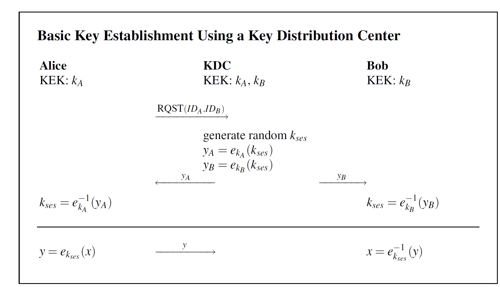

  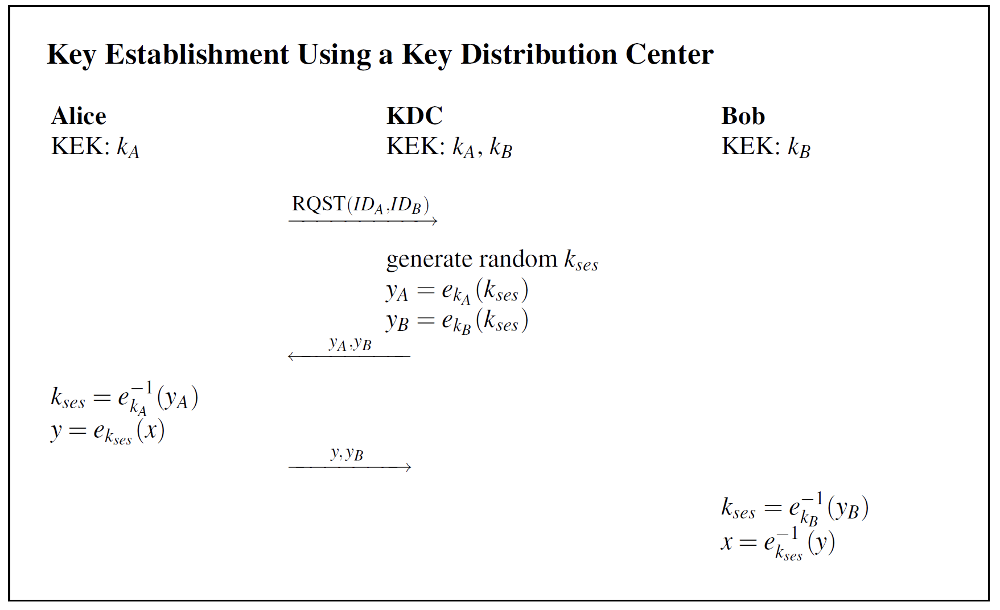

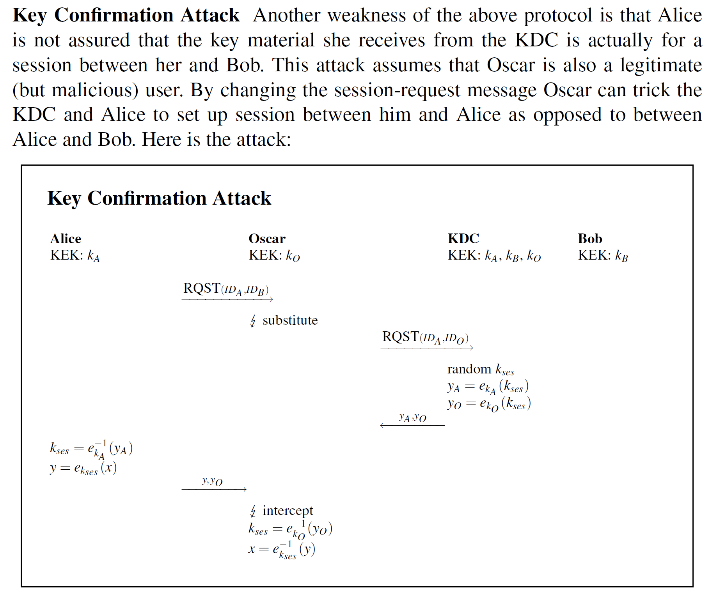

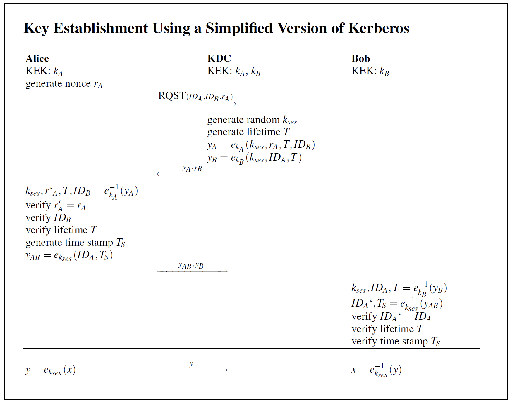

- 非对称密钥协商

  - DH密钥交换（双方）

  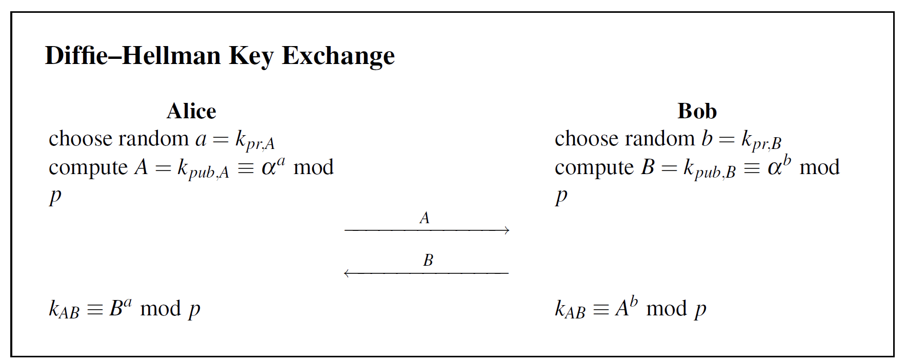

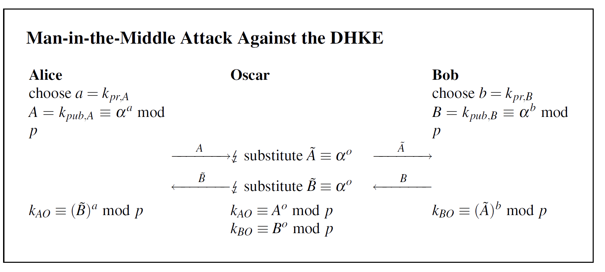

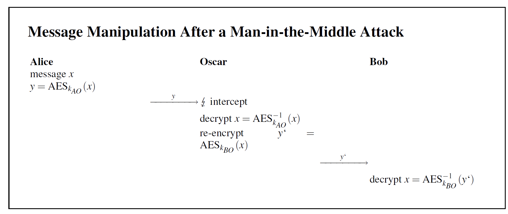

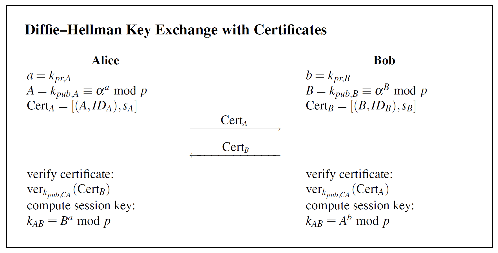

- **三方一轮协商**

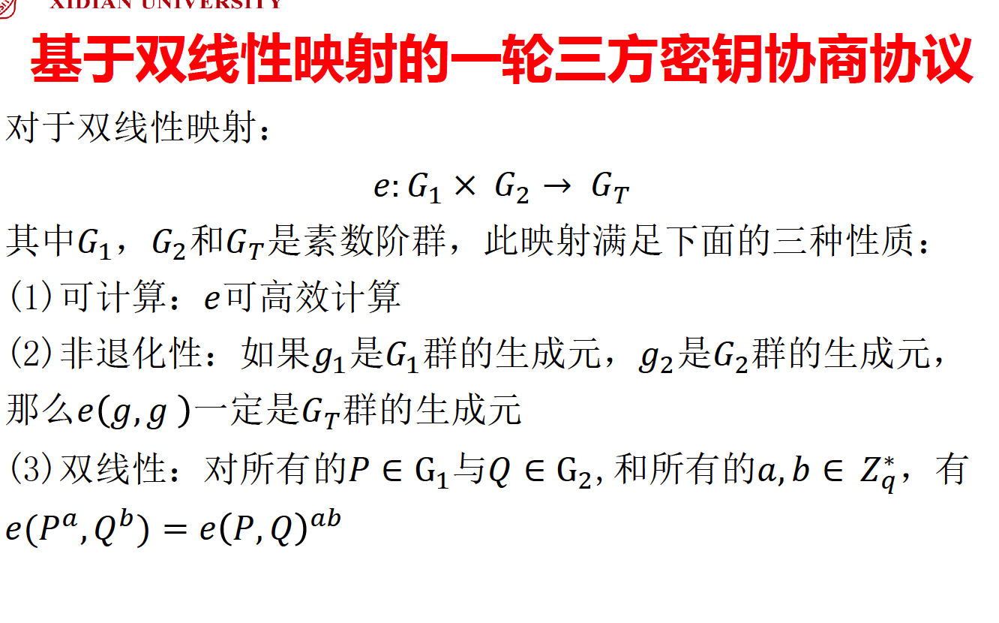

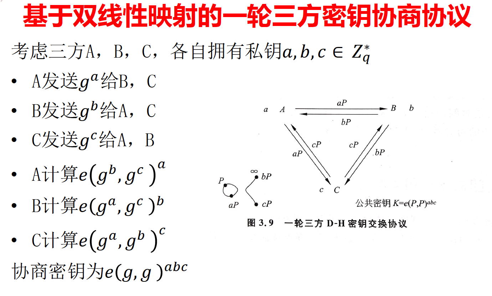

