> 王航专用《网络安全数学基础》复习笔记

---------

# 网络安全数学基础

[TOC]

**每章一个大题**

## 1、整除（计算）

- $b|a$：$b$是$a$的一个因数，$a$是$b$的倍数
- 整除的性质：
  - 加符号：$𝑏|𝑎 \Leftrightarrow (−𝑏)|𝑎 \Leftrightarrow  𝑏|(−𝑎)\Leftrightarrow (−𝑏)|(−𝑎)\Leftrightarrow |b|||𝑎|$
  - 传递性：$a|b,b|c \Rightarrow a|c$
  - 因数小于被除数（0除外）$a \neq 0, b|a \Rightarrow |b| \leq |a|$
  - $a|b且b|a \Rightarrow b=\pm a$
  - 线性组合性：$a|b,a|c \Leftrightarrow \forall x,t \in Z,a|bt+cs$
  - 消去律：$m \neq0, b|a \Leftrightarrow mb|ma$
- 带余除法
  - $a=qb+r$
- 最大公因数$(a,b)$
  - **公因性**：$d|a,d|b$
  - **最大性**：$\forall c \in Z, if \quad c|a \&c|b \Rightarrow c \leq d$
- 互素：如果$(a,b)=1$，则$a$和$b$互素
- 最小公倍数$[a,b]$
  - 公倍性：$m > 0, a|m,b|m$
  - 最小性：$\forall c \in Z, if \quad c > 0 \& a|c,b|c \Rightarrow m \leq c $
- 最大公因数与最小公倍数的性质：
  - 加符号：$(a,b)=(b,a)=(a,-b)=(-a,b)=(-a,-b)$
  - 加符号：$[a, b]=[b, a]=[a, -b]=[-a, b]=[-a, -b]$
  - $ a|b \Leftrightarrow(a,b)=|a|,[a,b]=|b|$
  - $\forall x \in Z,(a, b)=(a,b+ax)$，证明方式，大于等于且小于等于
  - $\forall d|a \in Z,[a,b]=[a,b,d]$,$\forall x \in Z,(a, b) = (a, b, ax)$
    - 例题：$(30,45,84)=(30, 15, 84)=(0,15,84)=(15,84)=(15,-6)=(3,-6)=3$
  - **最小性**：$a|c,b|c \Leftrightarrow [a,b]|c$
  - **最大性**：$d|a,d|b \Leftrightarrow d|(a,b)$
  - $𝑚(𝑎,𝑏)=(𝑚𝑎,𝑚𝑏)$,$𝑚[𝑎,𝑏]=[𝑚𝑎,𝑚𝑏]$
  - $[a,b]= \frac{|ab|}{(a, b)}$
  - 二元一次方程存在解的判定：$(𝑎,𝑏)=𝑚𝑖𝑛\{𝑠:𝑠=𝑎𝑥+𝑏𝑦,𝑥,𝑦 \in 𝑍,𝑠>0\}$
- 费马猜想：$2^{2^{n}}+1$是素数
- 梅森素数：$M_p=2^p-1$，其中$p$是素数，如果$M_p$是素数，则是梅森素数（也可能不是素数）
- 素因数标准分解：$n=p_1^{e_1}p_2^{e_2}…p_r^{e_r}$
- **欧拉算法：**（求最大公因数）

$$
a=bq_0+a_2 \qquad 0<a_2<b\\
b = a_2q_1+a_3 \qquad 0<a_3<a_2\\
\vdots \\
a_{n-2} = a_{n-1}q_{n-2}+a_n \qquad 0<a_n<a_{n-1} \\
a_{n-1}=a_n q_{n-1} \qquad
$$

则 $(a, b) = a_n$

- 素性检测：
  - Eratosthenes筛选法：划去所有小于$\sqrt{n}$中**素数**的倍数，剩余的数就是$n$内的素数
  - 基于Fermat小定理的Fermat素性检测
  - 基于强伪素数的Miller-Rabin算法

## 2、同余（计算）

- 定义：若$m$除$a,b$得到相同的余数，则称$a,b$模$m$同余。记做$a \equiv b (mod \ m)$,等价于$m|(a-b)$, $a=b+mx$
- 同余等价关系
  - 自反性
  - 对称性
  - 传递性
- 同余基本定理，$m \in N^+, a \equiv b(mod \ m), c \equiv d(mod \ m)$
  - $a+c \equiv b+d(mod \ m)$
  - $ac \equiv bd(mod \ m)$
  - $(a, m) = (b, m)$
  - $a \equiv b(mod \ m) \Leftrightarrow an \equiv bn(mod \ mn) $
  - $if \ n|m, \Rightarrow a \equiv b(mod \ m)$
  - $if \ k \in Z, ak \equiv bk(mod \ m) \Rightarrow a \equiv b(mod \ \frac{m}{(k,m)})$
  - $if \ m \in N^+, \forall 1 \leq i \leq n, m_i \in N^+ a \equiv b(mod \ m_i) \Leftrightarrow a\equiv b(mod [m_1,m_2,…,m_n])$
- **会求大指数的mod，模指数运算**
- 模逆存在定理
  - $ax \equiv xa \equiv 1(mod \ m)$，称$x$为$a$对 **模$m$的**逆，记做$a^{-1}(mod \ m)$
- **模逆求解**（扩展的欧几里得）
- Wilson定理：$p$为素数，则$(p-1)! \equiv -1 (mod \ m)$
- 同余类：给定正整数$m$,所有对$m$的余数相同的数字组成的集合，称为$m$的一个同余类：$\bar{1},\bar{2}$
- 完全剩余系：每个同余类中取出一个代表元组成的集合$\{1, 2, 3, 4, 5, 6\} = \{7,2, 9, 16,5, 6\}$其中$m=6$
- 既约剩余系：完全剩余系中和$m$互质的系
- **欧拉函数**$\varphi(m)$：小于$m$且与$m$互素的整数的个数。
- 同余类加法：$\bar{a}\bigoplus \bar{b}=\overline{a+b}$
- 同余类乘法：$\bar{a}\bigodot \bar{b}=\overline{a \cdot b}$
- 设$m$是正整数，$a,b \in Z$，且 $a,m=1$。若$x$遍历模$m$的一个完全剩余系，则$ax+b$也遍历模$m$的一个完全剩余系。
- $m_1,m_2$是两个互素的正整数，若$x_1,x_2$分别是遍历模$m_1,m_2$的既约剩余系，则$m_2x_1+m_1x_2$ 是遍历模$m_1m_2$的既约剩余系。
- **若$m_1,m_2$互素则**$\varphi(m_1m_2)=\varphi(m_1)\varphi(m_2)$
- $m=p_1^{e_1}p_2^{e2}…p_s^{e_s}\\   \varphi(m)=(p_1^{e_1}-p_1^{e_1-1})(p_2^{e_2}-p_2^{e_2-1})…(p_s^{e_s}-p_s^{e_s-1})$
- $\varphi(p) = p-1$
- Euler定理（求$a^{-1}$）：若$(a,m)=1$,则$a^{\varphi(m)} \equiv 1(mod \ m)$、$a^{\varphi(m)-1} \equiv a^{-1}(mod \ m)$
- Fermat小定理（求$a^{-1}$）：$a^{p-1} \equiv 1 (mod \ m)$、$a^{p-2} \equiv a^{-1} (mod \ m)$

## 3、同余方程（计算）

- 二（多）元一次同余不定方程$ax+by=n$有解的充要条件$(a,b)|n$

$$
\left \{
	\begin{aligned}
	x = x_0+ \frac{b}{(a,b)}t\\ 
	y = y_0- \frac{a}{(a,b)}t
    \end{aligned}
\right.
$$

- 会多元求解（线代或者直接消元）
- 同余方程 $ax+b \equiv0(\mod \ m)$有解当且仅当$(a,m)|b$，有解时解的个数为$(a, m)$个，记$x_0$为其中的一个解，$0 \leq t<(a,m), t \in Z $，方程的通用解$x_0 + t \frac{m}{(a,m)}(mod \ m)$
- $ax \equiv b (mod \ m)$求解方法：
  - 1、判断有无解，有解条件$(a,m)|b$
  - 2、判断个数，$(a,m)$个
  - 求出一个解
    - 方法1：$x \equiv ba^{-1}(mod \ m)$，其中$a^{-1}$由扩展的欧几里得求得
    - 方法2：$x \equiv \frac{b}{a} \equiv \frac{b+wm}{a}…$直到该式右边为整数，本质使用的是**定义**
    - 方法3：$a^{-1}$的求解可以使用Fermat小定理或者Eurl定理（过程中结合快速指数算法）
    - 方法4：中国剩余定理（后面介绍）（$m$可分解）
  - 写出所有解$x_0 + t \frac{m}{(a,m)}(mod \ m)$
- 中国剩余定理

$$
\left \{
	\begin{aligned}
	x \equiv a_1(mod \ m_1)\\
	x \equiv a_2(mod \ m_2)\\
	\vdots\\
	x \equiv a_k(mod \ m_k)
	\end{aligned}
\right.
$$

其中$m_1,m_2,\cdots,m_k$**两两互素（不互素就得分拆）**，则上面方程组必有解， $m = \prod_{i=1}^{k}m_i$，解为
$$
x \equiv M_1M_1^{-1}a_1+M_2M_2^{-1}a_2+\cdots+M_kM_k^{-1}a_k(mod \ m)
$$
其中$\forall 1\leq j \leq k, M_j=\frac{m}{m_j}, M_j^{-1}$满足$M_jM_j^{-1} \equiv1(mod \ m_j)$

- 中国剩余定理的应用：
  - 求解同余方程：分解后面的$m$
  - 求解同余方程组：分解为更多简单方程
  - 求解大指数的余数：结合费马小定理生成同余方程组

## 4、二次剩余（符号计算）

- $p$为奇素数，$p \nmid a$若同余方程$x^2 \equiv a(mod\ p)$有解，==则称$a$是模$p$的二次剩余==，否则为二次非剩余。

- ==知道$p$求所有$a$问题==：设$p$为奇素数，在模$p$的一个既约剩余系中，有$\frac{p-1}{2}$个模$p$的二次剩余。分别是模$p$意义下$1^2,2^2,\cdots,(\frac{p-1}{2})^2$,$\frac{p-1}{2}$个模$p$的二次非剩余。

- 如果$i$是则$p-i$肯定不是

- 知道$p$判断某个$a$是不是二次剩余（欧拉判别法）：

  - 若$a^{\frac{p-1}{2}} \equiv 1(mod\ p)$,$a$是$p$二次剩余（求解过程用到快速指数）
  - 若$a^{\frac{p-1}{2}} \equiv -1(mod\ p)$,$a$是$p$二次非剩余

- Legendre符号（知$p$求$a$）：1二次剩余、-1二次非剩余、0 a是p的倍数

  - 定义计算：$(\frac{a}{p}) \equiv a^{\frac{p-1}{2}}(mod\ p)$

  - $p$为奇素数：$(\frac{a}{p})=(\frac{a+p}{p})$

  - $p$为奇素数，若$p \nmid ab$：$(\frac{ab}{p}) = (\frac{a}{p}) (\frac{b}{p})$

  - $(\frac{1}{p})=1$

  - $$
    (\frac{-1}{p})=(-1)^{\frac{p-1}{2}}=\left \{ 
    \begin{aligned} 
    1,\; p\equiv 1(mod\ 4)\\
    -1,\; p\equiv 3(mod\ 4)\\
    \end{aligned} 
    \right.
    $$
    
  - $$
    (\frac{2}{p})=(-1)^{\frac{p^2-1}{8}}=\left \{ 
    \begin{aligned} 
    1,\; p\equiv \pm 1(mod\ 8)\\
    -1,\; p\equiv \pm 3(mod\ 8)\\
    \end{aligned} 
    \right.
    $$
  
  - $$
    (\frac{q}{p})=(\frac{p}{q})(-1)^{\frac{p-1}{2}\cdot{\frac{q-1}{2}}}
    $$
  
- 设$m$为大于1的奇数，$a \in Z$，Jacobi符号定义为：$(\frac{a}{m})=(\frac{a}{p_1})(\frac{a}{p_2}) \cdots (\frac{a}{p_s})$，其中$m=p_1p_2 \cdots p_s$

- Jacobi计算

  - $(\frac{ab}{m})=(\frac{a}{m})(\frac{b}{m})$

  - $(\frac{a}{mn})=(\frac{a}{m})(\frac{a}{n})$

  - $(\frac{a+m}{m})=(\frac{a}{m})$

  - $(\frac{1}{m})=1$

  - $$
    (\frac{-1}{m})=(-1)^{\frac{m-1}{2}}=\left \{ 
    \begin{aligned} 
    1,\; m\equiv 1(mod\ 4)\\
    -1,\; m\equiv 3(mod\ 4)\\
    \end{aligned} 
    \right.
    $$

  - $$
    (\frac{2}{m})=(-1)^{\frac{m^2-1}{8}}=\left \{ 
    \begin{aligned} 
    1,\; m\equiv \pm 1(mod\ 8)\\
    -1,\; m\equiv \pm 3(mod\ 8)\\
    \end{aligned} 
    \right.
    $$

  - $$
    (\frac{n}{m})=(\frac{m}{n})(-1)^{\frac{m-1}{2}\cdot{\frac{n-1}{2}}}
    $$

- Jacobi符号等于1不一定有解

## 5、原根

- $ord_m(a)\;a$对模$m$的阶：$(a,m)=1, a^d \equiv1(mod\ m)$成立的最小正整数$d$。  Fermat小定理联系一下
- 原根：当$ord_m(a)=\varphi(m)$时，称$a$是模$m$的原根

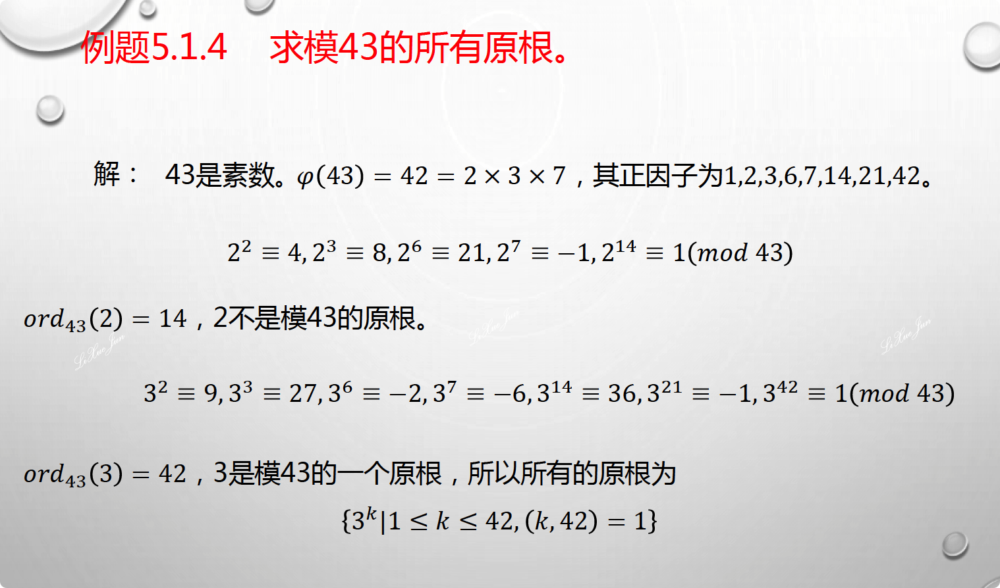

- $ord_m(a)|\varphi(m)$ 该式用来减少寻找范围，原根一定是欧拉函数的因子
- 若$a^k \equiv a^l (mod\ m) \Rightarrow k \equiv l(mod\ ord_m(a))$
- $a^0,a^1, \cdots,a^{ord_m{(a)}-1}$这$ord_m(a)$个模数$m$两两不同余
- $m$的既约剩余系，$\{0, g^0, g^1, \cdots, g^{\varphi(m)-1}\}$,其中$g$为模$m$的原根， 当$m$素数时，上述结果为完系
- $ord_m(a^k)=\frac{ord_m(a)}{(k,ord_m(a))}$
- $a^k$对模$m$的阶也为$ord_m(a)$的充要条件是$(k,ord_m(a))=1$

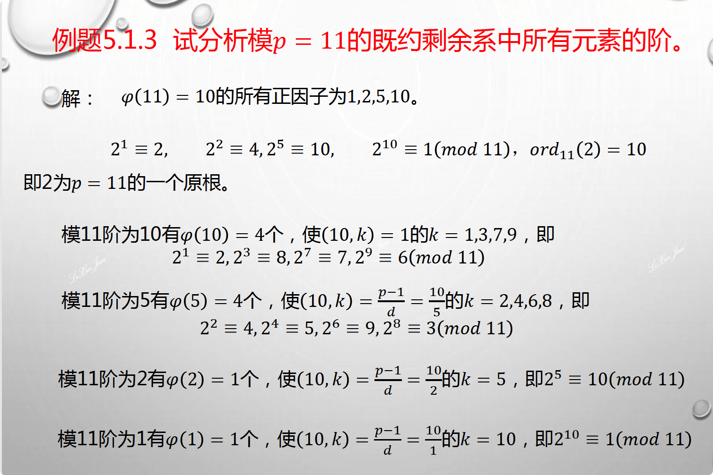

- $m=p_1^{e_1}p_2^{e_2} \cdots p_s^{e_s}$ ,$ord_{p_i^{e_i}}(a)=d_i$，则 $ord_m(a)=[d_1,d_2,\cdots,d_s]$

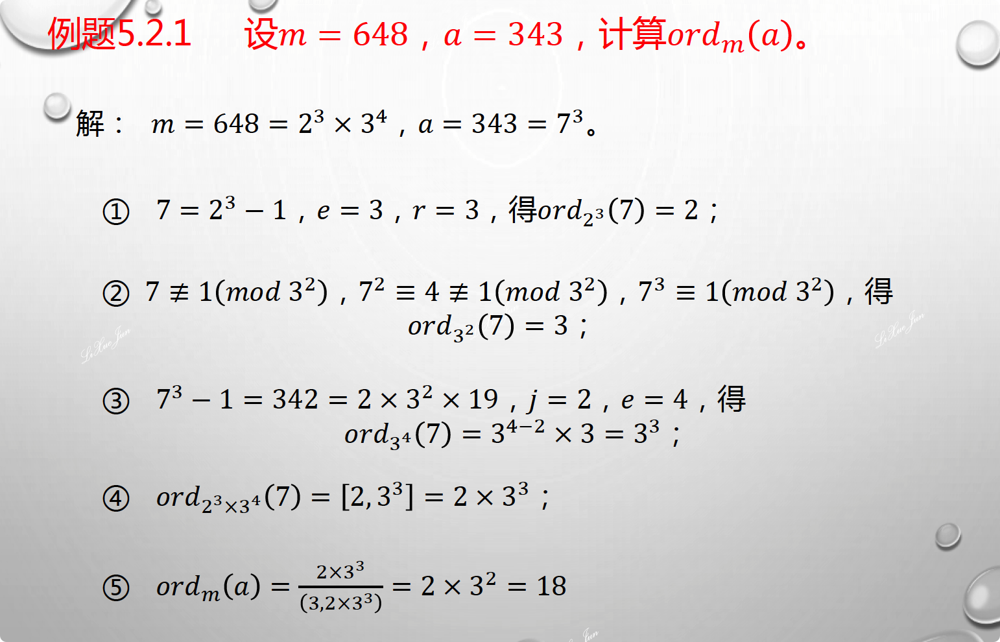

- **计算看看ppt**

## 6、群（判别代数系统）

- 半群

  - 封闭性：$\forall a,b \in G, a \cdot b \in G$
  - 结合性：$\forall a,b,c \in G, a \cdot(b \cdot c)=(a \cdot b) \cdot c$
- 含幺半群

  - 半群+单位元：$e \cdot g = g \cdot e=g$
- 群

  - 含幺半群+可逆：$g \cdot g^{'}=g^{'} \cdot g = e $
- 交换群（Abel群）

  - 群+交换：$a\cdot b = b \cdot a$
- **群的证明**
- 子群：$H$为$G$的一个非空子集，若$H$对$G$的运算$\cdot$也构成群，则$H$为$G$的子群，记做$H \leq G$

  - 平凡子群：$H=\{e\}$和$H=G$
  - 真子群：子群中除了平凡子群
  - $H \leq G$
  - $\forall a,b \in H,ab \in H, a^{-1} \in H$
  - $\forall a, b \in H, ab^{-1} \in H$
- 陪集：
  - $H \leq G, g \in G$集合$gH=\{g \cdot h| h \in H\}$ 称为$g$关于子群$H$的左陪集，$g$称为陪集代表元，右陪集定义类似
  - $aH=bH \Leftrightarrow a^{-1}b \in H$
  - $\forall a, b \in G, aH=bH$或者$aH \ \cap \ bH= \varnothing$
- $H$在$𝐺$中的指数$[G:H]$：
  - 子群$H$在群$G$中不同陪集的个数
  - $|G|=|H| \cdot[G:H]$

- 正规子群$H\vartriangleleft G$：
  - $H \leq G$ 中若$\forall a \in G$均有$aH=Ha$，则称$H$为$G$的正规子群
  - 当$G$为Abel群时，它的任意子群均为正规子群
  - $\{e\}$和$G$为$G$的两个平凡正规子群
- 商群$G/H$
  - 设$H\vartriangleleft G$，令$G/H$表示正规子群$H$在群$G$中的全部不同的陪集组成的集合，则$G/H$关于子集的乘法构成一个群
- 群同态和群同构：不考 :car:
- 循环群：
  - 设$G$为群，$a \in G$，则使$a^n=e$成立的最小正整数$n$称为$a$元素的**阶** ，记为$ord(a)$。如果不存在这样的正整数$n$，则称元素$a$为无限阶
  - $a^m=e \Leftrightarrow ord(a)|m$
  - $ord(a)=n$ 则$ord(a^k)= \frac{n}{(k,n)}$
  - **生成元：**群中元素由$a$生成，即$G=\{a^n|n \in Z\}$,记为$G=<a>$，这样的群称为**循环群**
  - 循环群群是Abel
  - $|G|=ord(a)$
  - 循环群的子群仍然是循环群
  - 素数阶群均为循环群，且该群中任意非单位元均为生成元。

## 7、环和域（判别代数系统）

- 环R的定义：
  - R关于加法运算$"+"$构成Abel群
  - R关于乘法运算$"\cdot"$构成半群
  - 乘法对加法的分配率成立：$\forall a,b,c \in R. a\cdot(b+c)=a \cdot b + a \cdot c,\;(b+c) \cdot a= b \cdot a + c \cdot a$
  
- 交换环：
  
  - 环R关于$"\cdot"$满足交换律：$a \cdot (b+c) = (b+c) \cdot a$
  
- 含幺环：
  
  - 环R关于乘法$"\cdot"$含有单位元：$e \cdot (a+b) = (a+b)\cdot e = (a+b)$
  
- 整环：
  
  - 环+交换+含幺+无零因子
  
- 除环：
  
  - 整环+逆元=环+乘法全体构成群
  
- 域：
  
  - 除环+交换=环+乘法群体构成Abel群=加法满足Abel+乘法满足Abel
  
- 域：
  - $a,b$为环R中的两个非零元，如果$ab=0$,则称$a,b$为零因子
  - 含幺交换环，无零因子，称之为**整环**
  - 环R中的非零元全体在乘法运算$"."$构成群，称该环为**除环**
  - 可交换的除环称之为**域**
  
- 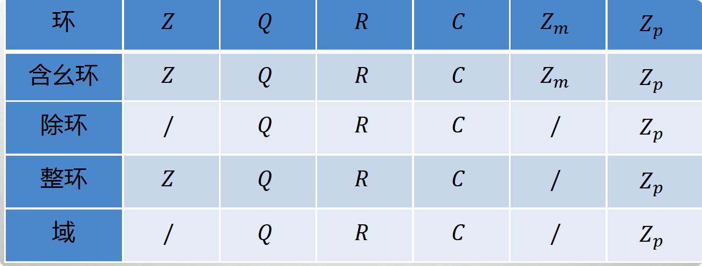

- 子环：

  - 设$R$为环，$R^{'}$为$R$的一个非空子集，$R^{'}$关于$R$的"+"、"$\cdot$"运算构成一个环，则$R^{'}$为$R$的一个子环，记做 $R^{'} \leq R$
  - 子环和环具有相同的加法单位元和不同的乘法单位元

- 理想$I \vartriangleleft R$ （和正规子群对比着看）：

  - 设$I$为环$R$的一个子环，如果对任意的$a \in I,r \in R$，有 $ar \in I, ra \in I$，则称$I$为环$R$的一个理想。
  - $\{0\}$称为零理想，$R$称为单位理想，统称为平凡理想

- 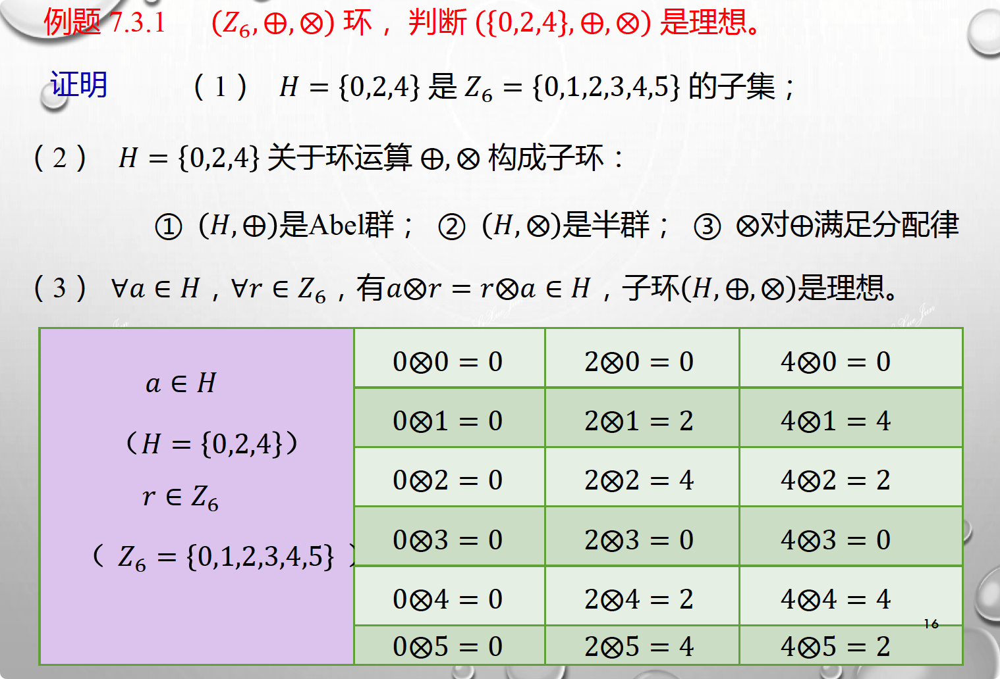

- 主理想（对照生成元）：

  - 含幺环$R$中，由一个元素$a \in R$生成的理想$I=(a)=\{ra|r \in R\}$

- 主理想环（对照循环群）：

  - 环$R$的所有理想都是主理想，则称环$R$为主理想环

- 商环$R/I$（对照商群）：

  - 环$R$中元素$a$模$I$的同余类：$[a]=a+I=\{a+i|i \in I\}$
  - 环$R$模$I$的同余类集合定义：$[a]+[b]=[a+_Rb]$、$[a] \cdot [b] = [a \cdot _R b]$

  - 环$R$模$I$的同余类的全体关于上述定义的"$+$"、"$\cdot$"运算构成的环，称之为环$R$关于理想$I$的商环

  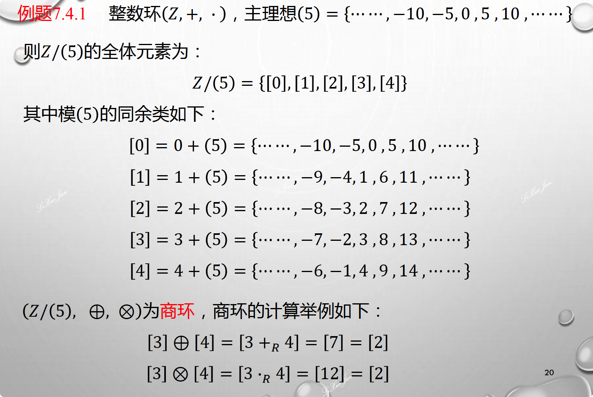

- 环同态：不考 :cat:

## 8、多项式环（欧几里得）

- 环$R$上的不定元 $x$的多项式全体

  - $R[x]=\{f(x)=a_nx^n+ \cdots +a_1x+a_0 |a_i \in R, n \in N\}$

  $$
  f(x)= a_nx^n+ \cdots + a_1x+a_0 \in R[x]\\
  g(x) = b_mx^m+ \cdots + b_1x+b_0 \in R[x]\\
  f(x)+g(x)= \sum_{i=0}^{n}(a_i+b_i)x^i\\
  f(x)\cdot g(x) = \sum_{i=0}^{n+m}x_kx^k,c_k=\sum_{i+j=k, 0\leq i \leq n, 0 \leq j \leq m}a_ib_j
  $$

  

- 多项式环：

  - 和环的定义相似：加法构成Abel群，乘法构成半群，乘法对加法有分配率

  - $R$是含幺环时，$R[x]$也是含幺环，且零次多项式为1
  - 当$R$是交换环时，$R[x]$也是可交换的

- 多项式的次数

  - $f(x)= a_nx^n+ \cdots + a_1x+a_0,a_n \neq 0$称多项式$f(x)$的次数为$n$，记做$deg(f(x))=n$,$a_n$称为$f(x)$的**首系数**

  - 首一多项式：环$R$含有单位元1，并且首系数是1

  - $deg(0)=- \infty$。这里0是指零元（零多项式）

  - $$
    deg(f(x)+g(x)) \leq max\{deg(f(x)),deg(g(x))\}\\
    deg(f(x)g(x)) \leq deg(f(x))+deg(g(x))
    $$

  - 当$R$为整环时$deg(f(x)g(x)) = deg(f(x))+deg(g(x))$

- 当$R$为一整环，则多项式环$R[x]$也是一个整环

- 当$R$为一整环，则多项式环$R[x]$中的逆元就是$R$中的可逆元

- 若$f(x)=g(x)q(x)$，则$g(x)$整除$f(x)$,记做$g(x)|f(x)$

- 若$f(x)=g_1(x)g_2(x)$,则$g_1(x)$或$g_2(x)$为常数，那么称$f(x)$为多项式混$F(x)$中的不可约多项式

- $f(x)=q(x)g(x)+r(x)$，其中$deg(r(x))<deg(g(x))$

- 因式分解唯一定理

- 根

- 判断不可约多项式

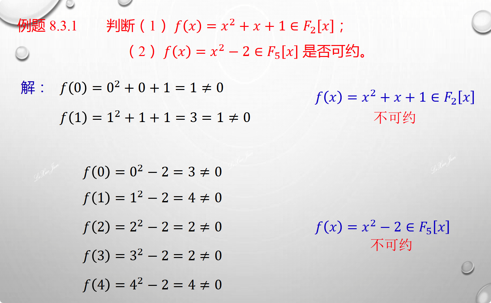

- 若$def(f)= n$,则$f(x)$在$F$上最多有$n$个不同的根
- 最大公因式，最小公倍式子求解

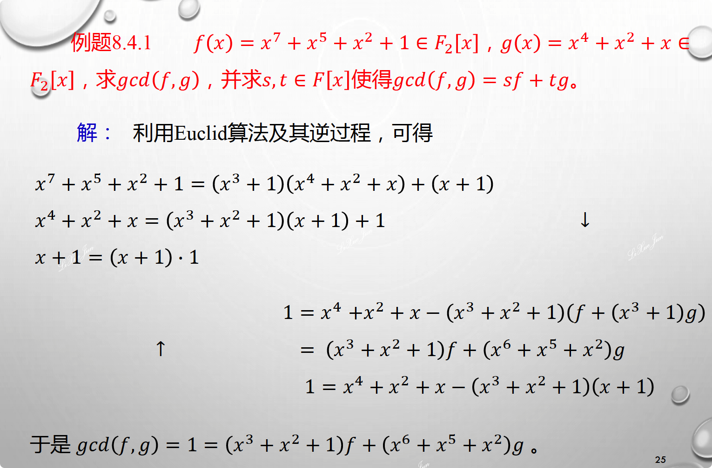

## 9、有限域

- 域的定义
- 阶数有限的域，称为有限域，或者伽罗瓦（Galois Filed）
- 域的特征：
  - 设$F$是一个域，1是其乘法单位元，如果存在一个最小的正整数$m$，使得$m \cdot 1=0$,则称域$F$的特征为$m$，记做$char(F)=m$
  - 如果这样的正整数不存在，则称域的特征为0，记做$char(F)=0$
  - 如果域的特征为$m$,则对于域$F$的任意元素$a$,都有$m \cdot a= 0$
  - $F$的**特征要么是0，要么是一个素数$p$，****反证法**
  - 有限域的特征为一个素数
  - 有限域$F_q$的乘法群都是循环群
- **本原元：**
  - 有限域$F_q$的乘法群的生成元，叫做域$F_q$的本原元
  - 本原元的个数为$\varphi(q-1)$
- 素域：
  - 如果一个域不含有任何真子域，则称这样的域为素域
- 扩域：
  - $F$为一个域，$K$为$F$的一个非空子集，如果相对于$F$中的加法和乘法，$K$也构成一个域，则称$K$是$F$的一个**子域**，$F$为$K$的一个**扩域**。
- 同态同构不考:basketball:
- 任意一个域可视为素域$F_q$或者$Q$的一个扩张
- 最小子域$K(M)$
- 代数元：$f(\alpha)=0$,则称$\alpha$为$K$的**代数元**，否则为**超越元**
- 若扩域$F$中的元素都是$K$上的代数元，则称$F$为$K$的代数扩域
- 极小多项式：由代数元$\alpha$确定的首一多项式$m_{\alpha}(x) \in K[x]$，称为$\alpha$在$K$上的极小多项式
- 有限域上元素性质

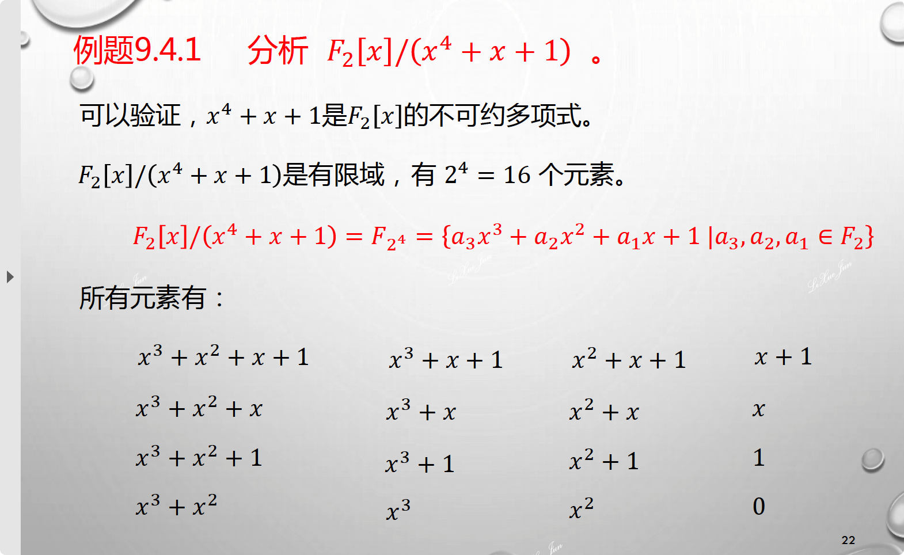

- 重要例题：**关键寻找本原元**

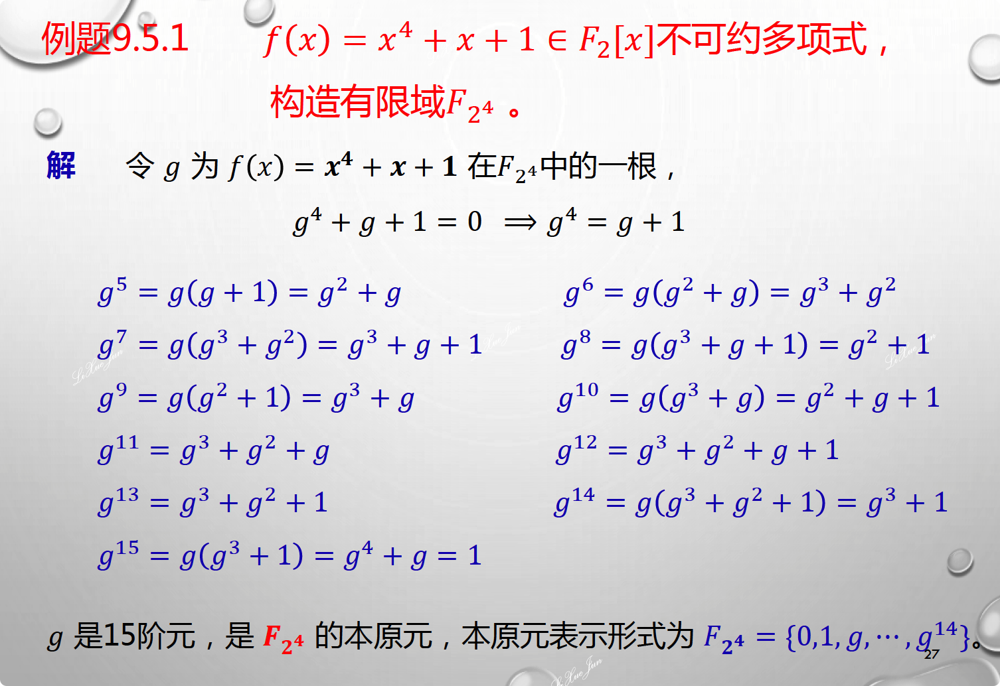

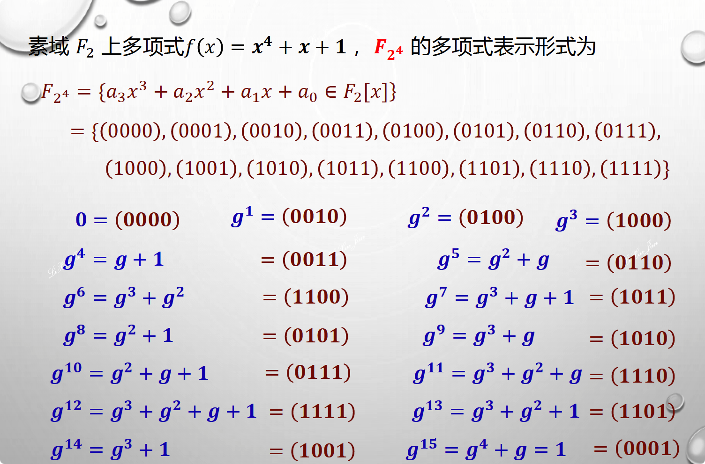

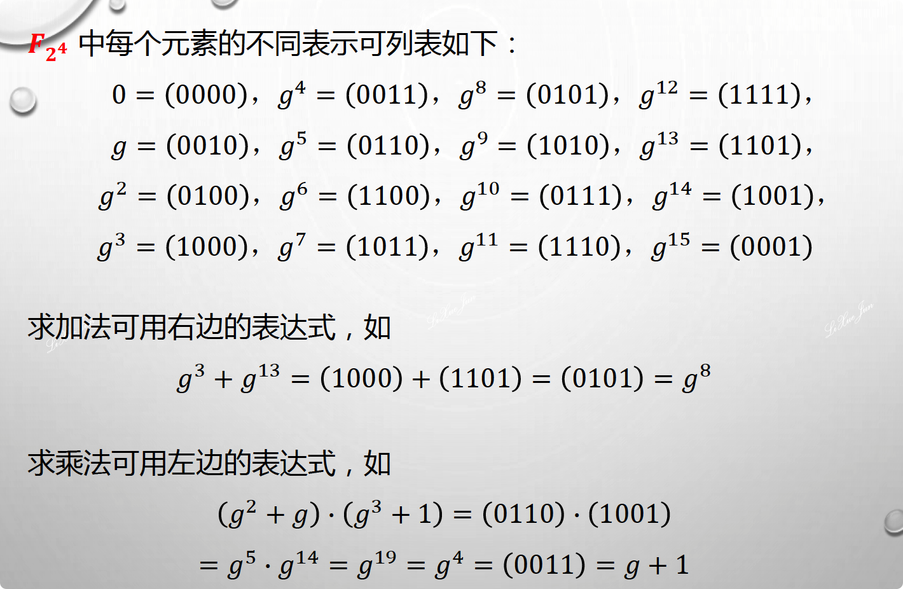

## 10、椭圆曲线点计算（$F_p$或者$2^m$扩域）

- $E:y^2=x^3+a_4x+a_6$，判别式$\Delta = -16(4a_4^3+27a_6^2) \neq 0$

- $F_p$点的计算，$P_1=(x_1,y_1),P_2=(x_2,y_2)$是曲线$E$上的两个点，$O$为无穷远点，则

  - $O+P_1=P_1+O$

  - $-P_1=(x_1,-y_1)$

  - $P_3=(x_3,y_3)=P_1+P_2 \neq O$

  - $$
    \left \{
    \begin{aligned}
    x_3=\lambda ^2-x_1-x_2\\
    y_3=\lambda(x_1-x_3)-y_1
    \end{aligned}
    \right.
    $$

  - $$
    \lambda =
    \left \{
    \begin{aligned}
    \frac{y_2-y_1}{x_2-x_1},\ x_1 \neq x_2\\
    \frac{3x_1^2+a_4}{2y_1},\ x_1=x_2
    \end{aligned}
    \right.
    $$
  
- $F_{2^n}$点的计算，$P_1=(x_1,y_1),P_2=(x_2,y_2)$是曲线$E$上的两个点，$O$为无穷远点，则

  - $O+P_1=P_1+O$

  - $-P_1=(x_1,x_1+y_1)$

  - $P_3=(x_3,y_3)=P_1+P_2 \neq O$

  - $$
    \left \{
    \begin{aligned}
    x_3=\lambda ^2 + \lambda +x_1+x_2+a_2\\
    y_3=\lambda(x_1+x_3)+x_3+y_1
    \end{aligned}
    \right.
    $$

  - $$
    \lambda =
    \left \{
    \begin{aligned}
    \frac{y_2+y_1}{x_2+x_1},\ x_1 \neq x_2\\
    \frac{x_1^2+y_1}{x_1},\ x_1=x_2
    \end{aligned}
    \right.
    $$

  

## 11、方案（DH密钥交换和RSA）

- **RSA**
  - 密钥生成过程
    - 随机产生大素数$p$和$q$
    - 计算$n=pq$和$\varphi(n)=(p-1)(q-1)$
    - 随机选择整数$e,1<2<\varphi(n)$，使得$(e,\varphi(n)) = 1$
    - **计算整数$d$，使得$ed \equiv1(mod \ \varphi(n))$**
    - 公钥$K_A^e= (n, e)$
    - 私钥$K_A^d= d$
  - **加密过程**
    - $c \equiv m^e(mod \ n)$
  - 解密过程
    - $m\equiv c^d(mod \ n)$

- 基于同余方程的仿射加密
  - $P$明文空间，$C$密文空间，$K=\{(a,b) \in Z_{26} \times Z_{26}:(a,26) = 1\}$密钥
  - 加密运算：$C \equiv am+b(mod \ 26)$
  - 解密运算：$M \equiv a^{-1}(C- b)(mod \ m)$
  
- 基于中国剩余定理的秘密共享算法

  - 条件将秘密$k$分成$n$个子秘密$k_1,k_2,\cdots,k_n$，满足下面条件：

    - 如果已知任意$t$个$k_i$值，易于恢复出$k$;
    - 少于$t$个不能恢复出$k$

  - **秘密分割**$(t,n)$门限，原理（大方程的解一定是小方程的，小方程不一定是大方程的）

    - $d_1<d_2<\cdots<d_n$（$d_n$严格递增）

    - $(d_i,d_j)=1$（两两互素）

    - $N=d_1 \times d_2 \times \cdots \times d_t\\ M=d_{n-t+2} \times d_{m-t+3} \times \cdots \times d_n$

    - 对某个秘密$k$,要求$N>k>M$,子秘密为$(d_i,k_i)$

    - $$
      \left \{
      	\begin{align}
      	k_1 \equiv k(mod \ d_1)\\
      	k_2 \equiv k(mod\ d_2)\\
      	\vdots\\
      	k_n \equiv k(mod\ d_n)
      	\end{align}
      \right.
      $$

  - 秘密恢复$(t,n)$门限

    - 任选$t$个：$(k_{i_1},d_{i_1}),(k_{i_2},d_{i_2}), \cdots,(k_{i_t}, d_{i_t})$

    - 基于中国剩余定理求解下列同余方程组

    - $$
      \left \{
      \begin{align}
      x \equiv k_{i_1}(mod\ d_{i_1})\\
      x \equiv k_{i_2}(mod\ d_{i_2})\\
      \vdots \\
      x \equiv k_{i_t}(mod\ d_{i_t})
      \end{align}
      \right.
      $$

    - $x \equiv k (mod\ N_1), N_1=d_{i_1}d_{i_2} \cdots d_{i_t}, N_1 \geq N>k$所以$N_1$的解肯定是原始方程的解

  - 为什么$t-1$个不能恢复呢？
    - $t-1$个恢复出来的秘密：$x \equiv k (mod\ M_1), M_1=d_{j_1}d_{j_2} \cdots d_{j_t}$
    - $k>M \geq M_1$，所以该方程的解一定不是原方程的解

- Rabin公钥加密（看一下为什么对）

  - 密钥产生：$n=pq$，$n$是公钥，$(p,q)$是私钥

  - 加密：

    - 将信息表示为整数$m, 0\leq m \leq n-1$
- 计算 $c \equiv m^2(mod\ n)$
  
- 解密
  
    - $$
      \left \{
      \begin{align}
      x^2 \equiv c (mod\ p)\\
      x^2 \equiv c (mod\ p)
      \end{align}
      \right.
      $$
    
- **DH密钥协商**
  - 公开参数$p$,以及模$p$的一个原根$g$
  - Alice：$1 \leq x< q, H_a \equiv g^x(mod\ p)$,并将$H_a$发给Bob
  - Bob：$1 \leq y< q, H_b \equiv g^y(mod\ p)$,并将$H_b$发给Alice
  - 会话密钥：
    - 对Alice：$k_1 \equiv H_b^x \equiv (g^y)^x（mod\ p)$
    - 对Bob：$k_2 \equiv H_a^y \equiv (g^x)^y（mod\ p)$
    - $k=k_1=k_2 \equiv g^{xy} (mod\ p)$

- 椭圆曲线加密（ECDSA）不考:soccer: